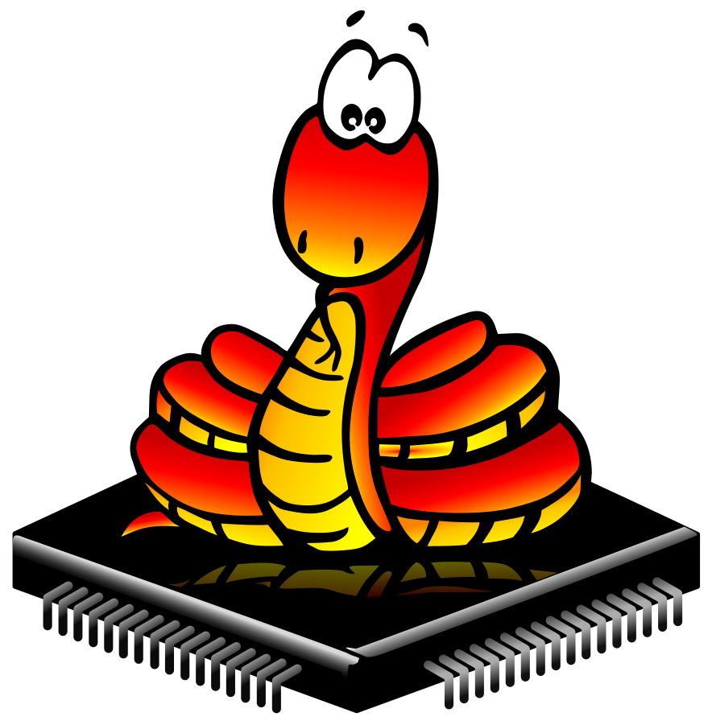
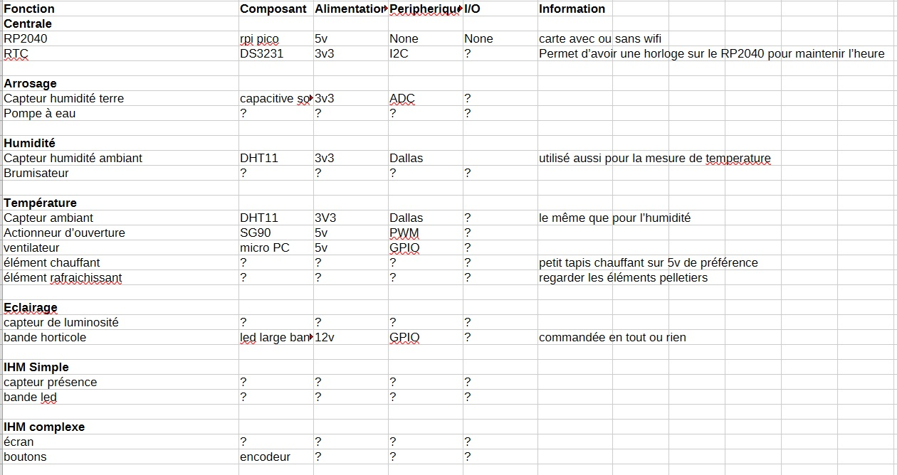
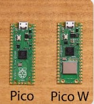
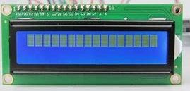
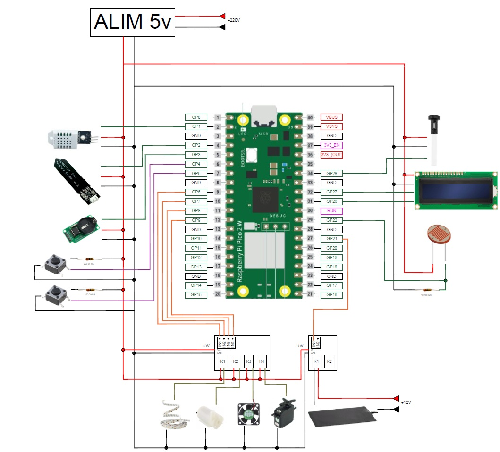

  
  

# Projet MJC Raspi 2025/2026

<h1 style="color: black; font-size: 52px; text-align: center; font-family: 'Verdana', sans-serif;">Mini Serre</h1>

<!-- Ceci est un saut de page (exportes en HTML/PDF via wkhtmltopdf) -->

<!-- --------------------------------------------------------------- -->

# 1 - Presentation

<!-- Ceci est un saut de page (exportes en HTML/PDF via wkhtmltopdf) -->

<!-- --------------------------------------------------------------- -->

# 2 - Liste des composants

  

<!-- Ceci est un saut de page (exportes en HTML/PDF via wkhtmltopdf) -->

<!-- --------------------------------------------------------------- -->

# 3 - Schéma de montage

<!-- Ceci est un saut de page (exportes en HTML/PDF via wkhtmltopdf) -->

<!-- --------------------------------------------------------------- -->

| Module              | GPIO Nb   | Module                    | GPIO Nb   |
|---------------------|-----------|---------------------------|-----------|
|                     | GPIO#0    | ----                      | ----    |
|                     | GPIO#1    | ----                      | ----    |
|                     | GPIO#2    | ----                      | ----    |
|                     | GPIO#3    |                           |  GPIO#28    |
|                     | GPIO#4    |                           |  GPIO#27    |
|                     | GPIO#5    |                           |  GPIO#26    |
|                     | GPIO#6    | ----                      | ----    |
|                     | GPIO#7    | ----                      | ----    |
|                     | GPIO#8    | ----                      | ----    |
|                     | GPIO#9    |                           |  GPIO#22    |
|                     | GPIO#10   |                           |  GPIO#21    |
|                     | GPIO#11   |                           |  GPIO#20    |
|                     | GPIO#12   |                           |  GPIO#19    |
|                     | GPIO#13   |                           |  GPIO#18    |
|                     | GPIO#14   |                           |  GPIO#17    |
|                     | GPIO#15   |                           |  GPIO#16    |

<!-- Ceci est un saut de page (exportes en HTML/PDF via wkhtmltopdf) -->

<!-- --------------------------------------------------------------- -->

# 4 - Code Micropython 

## 4.1 Librairies

<!-- Ceci est un saut de page (exportes en HTML/PDF via wkhtmltopdf) -->

<!-- --------------------------------------------------------------- -->

## 4.2 Mini Exemples d'utilisation pour chaque composant

- Ecran LCD
- OLED
- Capteur de T/Hum DHT11
- Horloge RTC
- Bouton
- Ruban Neopixel
- Buzzer ?

<!-- Ceci est un saut de page (exportes en HTML/PDF via wkhtmltopdf) -->

<!-- --------------------------------------------------------------- -->

## 4.3 Code principal

# 4 - Photos 

