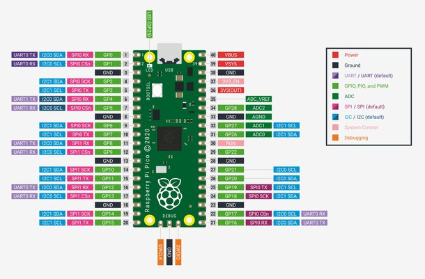

  
  

# Projet MJC Raspi 2025/2026

<h1 style="color: black; font-size: 52px; text-align: center; font-family: 'Verdana', sans-serif;">Mini Serre</h1>

<!-- Ceci est un saut de page (exportes en HTML/PDF via wkhtmltopdf) -->

<!-- --------------------------------------------------------------- -->

# 1 - Presentation

<!-- Ceci est un saut de page (exportes en HTML/PDF via wkhtmltopdf) -->

<!-- --------------------------------------------------------------- -->

# 2 - Liste des composants

Module d'affichage numérique LED TM1637, 4 Bits, pour arduino, 7 segments, 0.36 pouces, horloge, Tube d'anode rouge, carte de pilote à quatre séries:
https://a.aliexpress.com/_EvDb4YI

Capteur numérique de température et d'humidité DHT22, Module AM2302 + PCB avec câble pour Arduino
https://a.aliexpress.com/_EzFwt4S 

Technologie d'horloge en temps réel, RTC DS1302, AVR ARM PIC SMD, Ardu37
https://a.aliexpress.com/_EJDAHG2 

4010 12025 8010 30mm dc 5V 12V 24V ventilateur de refroidissement boîtier de moteur sans brosse silencieux 40MM 50MM 60MM 70MM 80MM 90MM 120MM pour impression 3D 2PIN
https://a.aliexpress.com/_EvwFRaO 

Système d'irrigation automatique, Kit de bricolage, pompe à eau pour serre de jardin, fleur, capteur d'humidité du sol pour Arduino Nano
https://a.aliexpress.com/_EJtVBwA 

 1 Servo étanche 20Kg 25Kg 30Kg 35Kg 40Kg, engrenage métallique, numérique, pour voitures RC à échelle 1/8 1/10
https://a.aliexpress.com/_Ex8E5fu 

Module d'atomiseur ultrasonique à pulvérisation unique DC 5V, Anti-brûlure sèche, détection anhydre, Module d'humidification de Type C
https://a.aliexpress.com/_EzwW7l8 

USB 5V LED plante poussent bande lumière spectre complet plante croissance lumière serre phytolampe pour plantes système de culture hydroponique
https://a.aliexpress.com/_EQDOr0a 

Module électroluminescent DC 3.3v-5v 10mm, capteur led, indicateur LED, module de tube électroluminescent pour arduino
https://a.aliexpress.com/_EIYqsom 

Coussin chauffant électrique en caoutchouc de Silicone, 5V 12V 24V 110V 220V, autocollant adhésif 3M, plaque chauffante, tapis, fil de sortie de renflement sportif moyen
https://a.aliexpress.com/_EHTmJga 

<!-- Ceci est un saut de page (exportes en HTML/PDF via wkhtmltopdf) -->

<!-- --------------------------------------------------------------- -->

# 3 - Schéma de montage

<!-- Ceci est un saut de page (exportes en HTML/PDF via wkhtmltopdf) -->

<!-- --------------------------------------------------------------- -->

| Module              | GPIO Nb   | Module                    | GPIO Nb   |
|---------------------|-----------|---------------------------|-----------|
|                     | GPIO#0    | ----                      | ----    |
|                     | GPIO#1    | ----                      | ----    |
|                     | GPIO#2    | ----                      | ----    |
|                     | GPIO#3    |                           |  GPIO#28    |
|                     | GPIO#4    |                           |  GPIO#27    |
|                     | GPIO#5    |                           |  GPIO#26    |
|                     | GPIO#6    | ----                      | ----    |
|                     | GPIO#7    | ----                      | ----    |
|                     | GPIO#8    | ----                      | ----    |
|                     | GPIO#9    |                           |  GPIO#22    |
|                     | GPIO#10   |                           |  GPIO#21    |
|                     | GPIO#11   |                           |  GPIO#20    |
|                     | GPIO#12   |                           |  GPIO#19    |
|                     | GPIO#13   |                           |  GPIO#18    |
|                     | GPIO#14   |                           |  GPIO#17    |
|                     | GPIO#15   |                           |  GPIO#16    |

<!-- Ceci est un saut de page (exportes en HTML/PDF via wkhtmltopdf) -->

<!-- --------------------------------------------------------------- -->

# 4 - Code Micropython 

## 4.1 Librairies

<!-- Ceci est un saut de page (exportes en HTML/PDF via wkhtmltopdf) -->

<!-- --------------------------------------------------------------- -->

## 4.2 Mini Exemples d'utilisation pour chaque composant

- Ecran LCD
- OLED
- Capteur de T/Hum DHT11
- Horloge RTC
- Bouton
- Ruban Neopixel
- Buzzer ?

<!-- Ceci est un saut de page (exportes en HTML/PDF via wkhtmltopdf) -->

<!-- --------------------------------------------------------------- -->

## 4.3 Code principal

# 4 - Photos 

