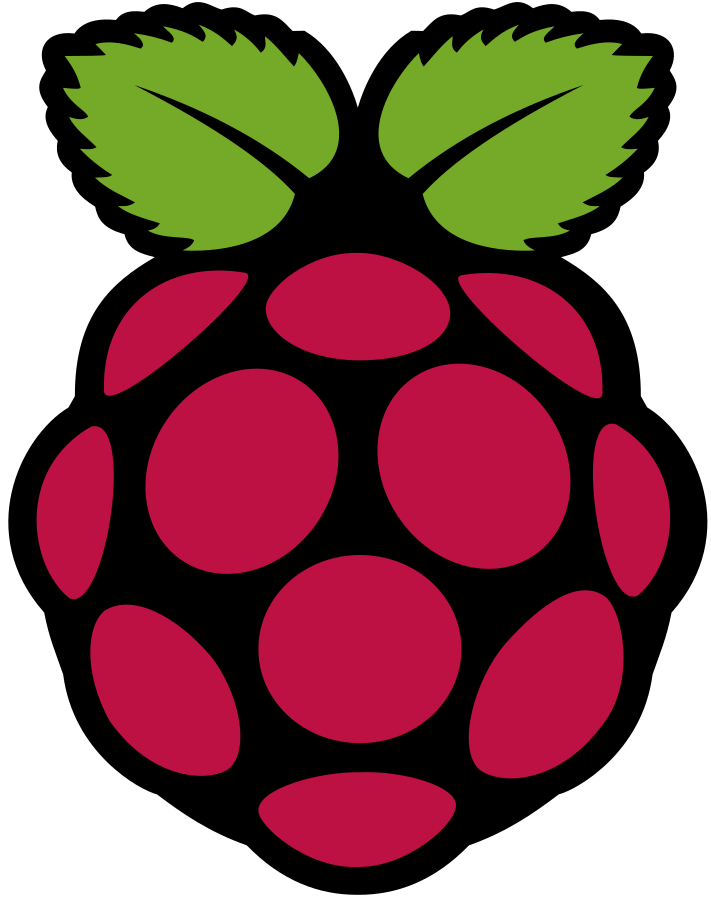

  
  

# Projet MJC Raspi 2025/2026

<h1 style="color: black; font-size: 52px; text-align: center; font-family: 'Verdana', sans-serif;">Mini Serre</h1>

<!-- Ceci est un saut de page (exportes en HTML/PDF via wkhtmltopdf) -->

<!-- --------------------------------------------------------------- -->

# 1 - Reunion preparatoire 28/AOUT/2025

- Forum des associations:

  - Samedi 6 Septembre 10h - 17h

- Liste des composants (voir fichier ods):

  - Raspberry Pi Pico Wifi
  - LEDs
  - LEDs RGB
  - Capteur Humidité DTH11
  - Afficheur Ecran OLED SSD1306 (Humeur de la plante, Affichage des paramètres)
  - Relais
  - Buzzer (Musique humeur de la plante)
  - ../.. 

- Propostion Seance 1 & 2 (SEPT/OCT):
  
   - Cours de Biologie
   - Presentation des composants selon les besoin
   - Placement/Routage au tableau
   - Utilisation de PCB & fil à wrapper

- A Faire:

  - Completer le fichier ods avec les composants et leurs references

